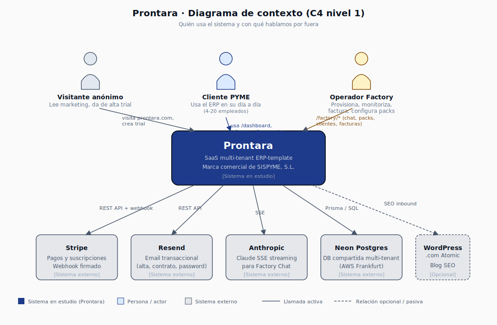
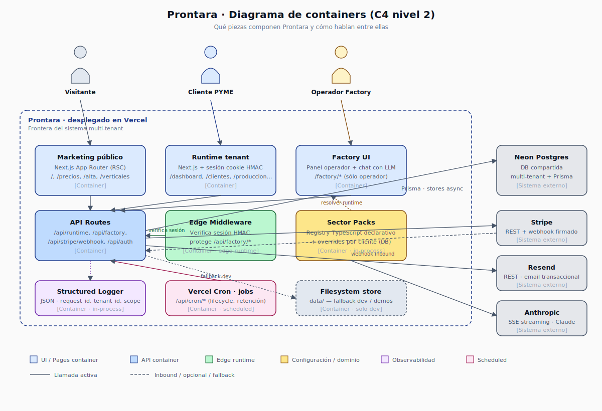

# Arquitectura visual de Prontara

Diagramas en formato [C4 Model](https://c4model.com/) (los dos primeros niveles, que es donde está casi todo el valor para una organización del tamaño de Prontara).

GitHub renderiza los SVG embebidos in-place — basta con abrir cada fichero para verlo.

## Nivel 1 · Contexto

> **¿Quién usa Prontara y con qué hablamos por fuera?**

Resumen:

- **3 actores humanos**: visitante anónimo (lee marketing y se da de alta), cliente PYME (usa el ERP día a día), operador Factory (Jorge — provisiona, monitoriza, factura, configura sector packs).
- **Servicios externos críticos**: Stripe (pagos + webhook firmado), Resend (email transaccional), Anthropic (LLM del Factory Chat), Neon Postgres (DB compartida en AWS Frankfurt).
- **Servicios externos opcionales**: WordPress.com Atomic (blog SEO inbound — desacoplado del producto, decisión revisable).

Lo que NO entra en este nivel: capas internas de Next.js, sector packs, persistencia dual, middleware. Eso es nivel 2.

## Nivel 2 · Containers

> **¿Qué piezas hay dentro de Prontara y cómo hablan entre ellas?**

Containers internos (todos viven en el mismo deploy de Vercel pero conceptualmente son piezas distintas):

| Container | Tipo | Responsabilidad |
|---|---|---|
| Marketing público | Pages (RSC) | `/`, `/precios`, `/alta`, `/verticales`. Sin auth. |
| Runtime tenant | Pages + sesión | `/dashboard`, `/clientes`, `/produccion`, etc. — un tenant por cookie. |
| Factory UI | Pages + chat | `/factory/*`. Solo para el operador. |
| API Routes | Endpoints | `/api/runtime`, `/api/factory`, `/api/stripe/webhook`, `/api/auth`. |
| Edge Middleware | Edge runtime | Verifica sesión HMAC, protege `/api/factory/*`. |
| Sector Packs | In-process registry | Catálogo TypeScript + overrides en DB (ver [ADR-0004](../adr/0004-sector-packs-declarativos.md)). |
| Structured Logger | In-process | Emite JSON con `request_id`, `tenant_id`, `scope` (ARQ-2 cerrado). |
| Vercel Cron | Scheduled | Lifecycle, retención, jobs periódicos en `/api/cron/*`. |
| Filesystem store | Solo dev / demos | Fallback `data/` cuando `PRONTARA_PERSISTENCE=filesystem` (ver [ADR-0003](../adr/0003-persistencia-dual-fs-postgres.md)). |

Servicios externos: igual que el nivel 1.

## Cómo actualizar los diagramas

Los SVGs son texto plano editable. Hay dos formas de mantenerlos:

### A. Editar el SVG directamente (recomendado para cambios pequeños)

Cada caja es un `<g transform="translate(x,y)">` con `<rect>` + `<text>`. Para mover una caja, cambia el `translate`. Para añadir una flecha, copia un `<line>` existente y ajusta puntos.

Ventaja: cero dependencias, diff de git legible (cambia una línea).

### B. Re-exportar desde Excalidraw (recomendado para reorganizar)

1. Importa el SVG en [excalidraw.com](https://excalidraw.com) (botón "Library / Import").
2. Reorganiza visualmente.
3. Exporta como SVG (`File → Export → SVG`, marcar "Embed scene" para poder reimportar).
4. Reemplaza el fichero en este directorio.

Ventaja: edición visual rápida.
Desventaja: el SVG resultante es más verboso y los diffs de git son menos legibles.

## Por qué C4 y no UML / arc42 / 4+1

C4 es el mínimo viable que sirve para explicar Prontara a alguien que no la conoce, sin imponer formalismo que requiera formación previa. Niveles 3 (Components) y 4 (Code) los omitimos a propósito: el código de Prontara es lo bastante autoexplicativo (TypeScript + estructura por carpeta) que duplicar esa información en un diagrama envejecería antes de servir.

Si en el futuro Prontara crece a varios deploys / servicios distintos (por ejemplo, separar Factory en su propio backend), entonces nivel 3 empezará a tener sentido y se añadirán aquí.

## Referencias cruzadas

- [`docs/adr/`](../adr/) — decisiones arquitectónicas que justifican estos diagramas.
- [`docs/persistence-architecture.md`](../persistence-architecture.md) — más detalle del runtime de persistencia.
- [`docs/vertical-pattern.md`](../vertical-pattern.md) — cómo se añade un nuevo sector pack.
- [`docs/deploy-vercel.md`](../deploy-vercel.md) — operativa del deploy.
